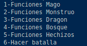
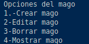
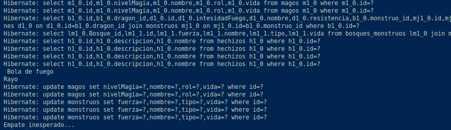
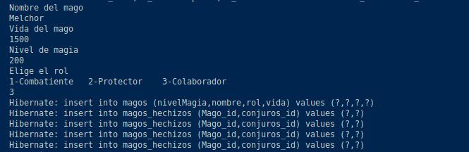
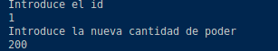
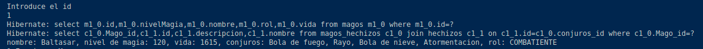

# Manual de instruccione - Dragonladia
## Ricardo Santos Ren - 2DAM

### Funcionamiento

        Al comenzar el juego se cargaran las todas las tablas vacías, excepto la tabla "hechizos",
    ya que esta se precargara con 4 hechizos los cuales a la hora de crear un mago se le 
    añadiran de manera default.

        Se mostrara un menu con 6 opciones, la primera opción sera la elección del submenu de 
    magos, donde se podran hacer todas las operaciones respectivas a los magos, crear magos,
    actualizarlos (cambiar el nivel de poder magico), borrar un mago y buscar un mago para 
    mostrar sus datos.

        La segunda opción del menu incluye el subemenu con las operaciones de los monstruos,
    crear, actualizar (cambiar el nivel de fuerza), borrar y actualizar.

        La tercera opción es para el submenu para las opciones del dragon, que serian las
    mismas que para las anteriores pero en el metodo actulizar se cambiaria el valor de la 
    intensidad del fuego del dragon.

        La cuarta opción es para realizar las operaciones de la tabla bosque, que son las
    mismas que en los casos anteriores pero al actulizar el bosque se permitira cambiar el 
    valor del nivel de peligro.

        La quinta opción es para el submenu con las operaciones de los hechizos, y en este
    caso la opcion de modificar hechizo premite cambiar la descripción del hechizo.

        La sexta opción permite simular una batalla en uno de los bosques entre dos magos 
    acompañados por el dragon en contra de los monstruos del bosque, incluyendo al mosntruo 
    jefe, la batalla acabara cuando todos los miembros de un bando mueren.

**Imagen de como se ve el menu principal**

### Capturas de la ejecución

    Cada uno de los submenus de la aplicacion siguen la misma estructura que en esta imagen: 

**Imagen de un submenu**

    Tras la ejecución de una batalla se montraran los hechizos lanzados por los magos y 
    el resultado de la batalla tras esa ronda

**imagen despues de una ronda de batalla**

    El Formulario de creación de uno de los elementos se veria de la siguiente manera

**Formulario de creacion**

    El formulario de actualizacion de un elemento se veria así

**Formulario de actualizacion**

    Los formulario de borrar y buscar se verian igual ya que solo se pide el id del elemento

**Formulario de borrado y busqueda**

         

    