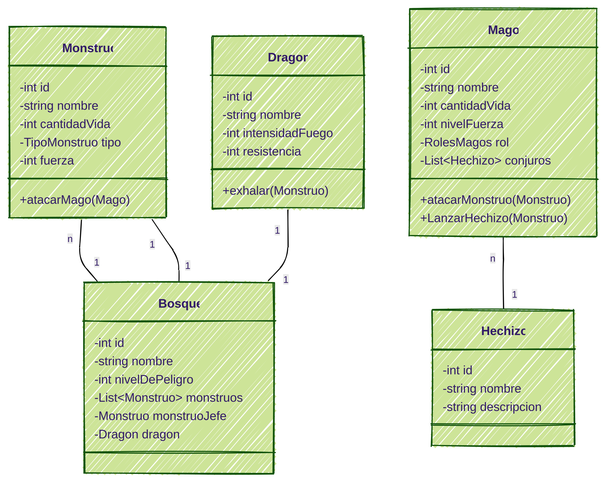
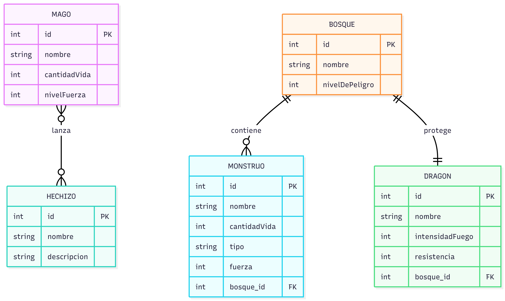

# DRAGONLANDIA
    Ricardo Andrés Santos Ren
    2 DAM

## Introduccion
    Dragonlandia es un minijuego, basado en la pelea entre magos y monstruos, el mago se adentra en el bosque y podra pelear con los monstruos, hasta llegar al monstruo jefe del bosque.

## Analisis

### DIAGRAMA DE CLASES

## DISEÑO 
### ENTIDAD-RELACION

## MEJORAS FUTURAS

    Me gustaria mejorar los metodos de lanzar hechizos, la logica de como funciona la batalla y
    aclarar el verdadero funcionamiento de la app